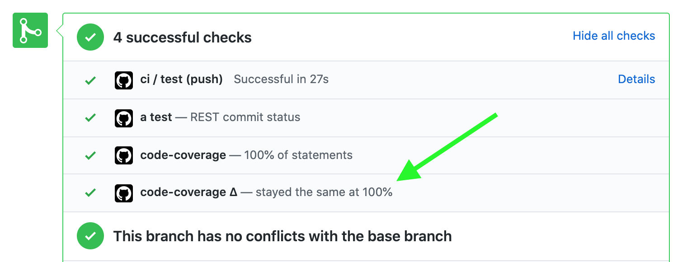

# check-code-coverage [![ci status][ci image]][ci url] 
> Utilities for checking the coverage produced by NYC against extra or missing files

## Use

```shell
npm i -D check-code-coverage
# check if .nyc_output/out.json has files foo.js and bar.js covered and nothing else
npx only-covered foo.js bar.js
```

## check-coverage

Checks if the file is present in the output JSON file and has 100% statement coverage

```shell
# check if .nyc_output/out.json has 100% code coverage for main.js
npx check-coverage main.js
# read coverage report from particular JSON file
check-coverage --from examples/exclude-files/coverage/coverage-final.json main.js
```

The file has to end with "main.js". You can specify part of the path, like this

```shell
npx check-coverage src/app/main.js
```

## only-covered

Check if the coverage JSON file only the given list of files and nothing else. By default `only-covered` script reads `.nyc_output/out.json` file from the current working directory. You can specify a different file using `--from` parameter.

```shell
# check if coverage has info about two files and nothing else
only-covered src/lib/utils.ts src/main.js
# read coverage from another file and check if it only has info on "main.js"
only-covered --from examples/exclude-files/coverage/coverage-final.json main.js
```

## check-total

If you generate coverage report using reporter `json-summary`, you can check the total statements percentage

```shell
check-total
# with default options
check-total --from coverage/coverage-summary.json --min 80
```

## update-badge

If your README.md includes Shields.io badge, like this

    

You can update it using statements covered percentage from `coverage/coverage-summary.json` by running

```shell
update-badge
```

If the coverage summary has 96%, then the above badge would be updated to

    

- The badges will have different colors, depending on the coverage, see [bin/update-badge.js](bin/update-badge.js)
- If the code coverage badge is not found, a new badge is inserted on the first line.

You can change the JSON summary filename to read coverage from:

```shell
update-badge --from path/to/json/summary/file.json
```

You can also skip reading file and set the coverage number directly

```shell
update-badge --set 78
update-badge --set 78%
```

Related project: [dependency-version-badge](https://github.com/bahmutov/dependency-version-badge)

## set-gh-status

If you run your tests on [GitHub Actions](https://glebbahmutov.com/blog/trying-github-actions/), there is an easy way to add commit status with code coverage percentage. From your CI workflow use command:

```yaml
- name: Set code coverage commit status 📫
  run: npx set-gh-status
  env:
    GITHUB_TOKEN: ${{ secrets.GITHUB_TOKEN }}
```

Which should show a commit status message like:


This script reads the code coverage summary from `coverage/coverage-summary.json` by default (you can specific a different file name using `--from` option) and posts the commit status, always passing for now.

If there is a coverage badge in the README file, you can add 2nd status check. This check will read the code coverage from the README file (by parsing the badge text), then will set a failing status check if the coverage dropped more than 1 percent. **Tip:** use this check on pull requests to ensure tests and code are updated together before merging.

```yaml
- name: Ensure coverage has not dropped 📈
  run: npx set-gh-status --check-against-readme
  env:
    GITHUB_TOKEN: ${{ secrets.GITHUB_TOKEN }}
```



## Debug

To see verbose log messages, run with `DEBUG=check-code-coverage` environment variable

[ci image]: https://github.com/bahmutov/check-code-coverage/workflows/ci/badge.svg?branch=master
[ci url]: https://github.com/bahmutov/check-code-coverage/actions
